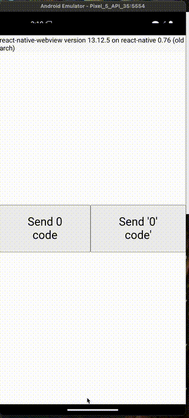
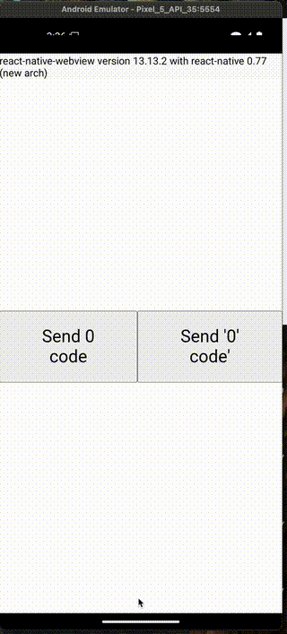

# React Native WebView Demo App

This app demonstrates the usage of React Native WebView with two different architectures.

| Old Architecture                       | New Architecture                       |
| -------------------------------------- | -------------------------------------- |
|  |  |

## Features

- WebView with two buttons:
  1. One button sends a code as a number
  2. Another button sends a code as a string
- Two branches:
  - `main`: Uses React Native's new architecture
  - `before-bug`: Uses React Native's old architecture

## Setup and Running the App

### Running the App (main branch - new architecture)

1. Clone the repository
2. Install dependencies:
   ```
   npm install
   ```
3. Start the Metro bundler:
   ```
   npm start
   ```
4. In a separate terminal, run the Android app:
   ```
   npm run android
   ```

### Switching to "before-bug" Branch (old architecture)

1. Fetch all branches:
   ```
   git fetch --all
   ```
2. Checkout the before-bug branch:
   ```
   git checkout before-bug
   ```
3. Clean and reinstall dependencies:
   ```
   rm -rf node_modules package-lock.json
   npm install
   ```
4. Start the Metro bundler:
   ```
   npm start
   ```
5. In a separate terminal, run the Android app:
   ```
   npm run android
   ```

## Troubleshooting

If you encounter any issues, try the following:

- Ensure all dependencies are correctly installed
- Clean the android build folder with `cd android && ./gradlew clean`
- Clean the build folders and rebuild the app
- Make sure your development environment is properly set up for React Native

For more information, refer to the [React Native documentation](https://reactnative.dev/docs/environment-setup).
